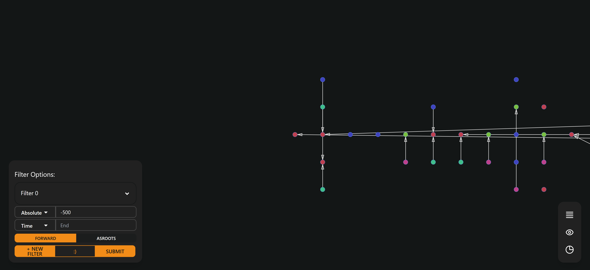

[](https://github.com/ItJustWorksTM/EiffelVis)

# EiffelVis

[](https://github.com/eiffel-community/community/blob/master/PROJECT_LIFECYCLE.md#stage-sandbox)
[](https://github.com/ItJustWorksTM/EiffelVis/actions/workflows/backend_ci.yml)
[](https://github.com/ItJustWorksTM/EiffelVis/actions/workflows/frontend_ci.yml)
[](./LICENSE)

EiffelVis is a scalable Eiffel pipeline traffic visualization stack built on Rust & Svelte. Briefly, the Eiffel protocol is a tool which helps control multiple CI/CD Pipelines within or across multiple projects. To learn more about the Eiffel Protocol, please visit the [Eiffel Community](https://eiffel-community.github.io/).

#### **Why should you use EiffelVis?**

The Eiffel Protocol consists of multiple [Eiffel Events](https://github.com/eiffel-community/eiffel/tree/master/eiffel-vocabulary) which each have a defined purpose and structure. In a typical CI pipeline which uses the Eiffel Protocol, there can be hundreds of events which are generated over a short time period. Visualizing large amounts of data such as thousands of Eiffel Events can be difficult, and that's where EiffelVis stands out. EiffelVis is a data visualization and data manipulation tool for Eiffel Events.

# Useful Links:

- [How to contribute](./CONTRIBUTING.md)
- [Issue tracker](https://github.com/ItJustWorksTM/EiffelVis/issues)
- [Website](https://itjustworkstm.github.io/EiffelVis/)
- [EiffelVis Backend](./backend)
- [EiffelVis Frontend](./frontend)

# Getting Started

These instructions are an example of how you may run EiffelVis locally.

## Prerequisites

- [NodeJS](https://nodejs.org/en/)
- [Rust](https://www.rust-lang.org/tools/install)

## Installation

1. Clone the repository using SSH (or HTTP)
   ```bash
   git clone git@github.com:ItJustWorksTM/EiffelVis.git
   ```
2. After going to the root folder where the repository was cloned, install dependencies for the frontend
   ```bash
   cd EiffelVis/frontend
   npm install
   ```
3. Compile and run the frontend
   ```bash
   npm run dev
   ```
4. The frontend will now be running on port `localhost:8080`. If you go to this address in your browser, you should be able to view the EiffelVis client. As you will see, there are no events and there is no graph. To see events we need to set up the backend through which we will also load the graph data.

5. As the client will be running in the current terminal, open a new terminal to run the backend. Go to the root directory of EiffelVis and run the commands
   ```bash
   cd EiffelVis/backend
   cargo run -- --help
   ```

Now that the application is running in these 5 simple steps, your client should look something like this: 

# Usage

Additional information that will be useful in helping you utilize EiffelVis to it's maximum potential.

For usage instructions and information regarding the client/frontend, please see the [frontend guide](./frontend/README.md), and for the backend, please see the [backend guide](./backend/README.md).

# Deployment

If you would like to deploy the application please refer to the [deployment guide](./DEPLOYMENT.md) for detailed instructions.

# About the Repository

The contents of this repository are licensed under the [Apache License 2.0](./LICENSE).

To contribute to this repository, please see the [contribution guidelines](./CONTRIBUTING.md).

If you would like to read more about the algorithm used by EiffelVis, please see the [algorithm concept](./frontend/README.md#layout-algorithm).

Copyright © 2022, EiffelVis. EiffelVis is a product by ItJustWorks™.
